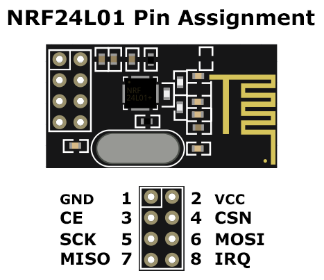

# ARDUINO + NRF24L01
---
---

## Introducción

EL modulo nRF24L01 es un transreceptor radio muy extendido entre dispositivos de comunicación por radio de cualquier tipo (drones, ratones, teclados, ...)

Este modulo utiliza un protocolo de comunicación propietario de Nordic (su fabricante) para comunicarse con sus nodos a través de la banda ISM 2.4 GHz llamado ESB (Enhanced Shockbrust Protocol).

Su conexion, que puede alcanzar los 50-100 metros o incluso 200 mediante una modificación en la antena, es de hasta 2Mbps y utiliza modulación GFSK (Gaussian frequency-shift keying)

La topología puede ser de hasta 6 nodos mediante pipes, aunque el protocolo soporta hasta 125 canales de comunicación teóricos.


Para comunicarse con la Arduino utilizan el protocolo SPI (Serial Peripheral Interface)

## Protocolo SPI

El protocolo SPI permite a un dispositivo maestro (la Arduino en este caso) comunicarse con uno o más dispositivos exclavos (en este caso el nRF24L01).

Este protocolo requiere minimo 4 conexiones principales:
- MOSI (Master Out Slave In): Que transmite datos del maestro al esclavo
- MISO (Master In Slave Out): El caso contrario, del eslavo al maestro.
- SCK (Serial Clock): Señal de reloj generada por el maestro (sincronización)
- CSN (Chip Select Not)

En el caso de NRF24L01 tambien disponemmos de CE y IRQ. 

En la práctica existen librerias que facilitan la utilización de este protocolo permitiendonos centrarnos en la comunicación por ESB.

## Protocolo ESB

El Enhanced Shockbrust Protocol utiliza paquetes de conexión con la siguiente estructura:

- Preamble: 1 byte 
- Address: 3-5 byte
- Packet Control: 9 byte
  - Payload Length: 6 byte
  - Packet ID: 2 byte
  - No ACK: 1 byte
- Payload: 0-32 byte
- CRC: 1-2 byte

Tiene características de retransmisión automática del paquete (si este no ha sido recibido) y auto-ACK.


## Practica: Comunicar dos Arduino UNO

Para profundizar, he decidido conectar dos Arduino UNO mediante dos modulos nRF24L01 utilizando ambos protocolos.

### Hardware

El circuito solo va a constar del modulo nRF24L01 y la Arduino UNO.

Aparte voy a utilizar una placa de prototipos y un condensador de 100uF para estabilizar la alimentación del modulo para evitar interferencias. Esto ultimo no es necesario pero evita problemas. (También se puede soldar el condensador directamente al modulo)

#### Pines de la nRF24L01

Para conectar el modulo nRF24L01 a la Arduino lo primero es conocer donde estan los pines necesarios para la comunicación por SPI. 



Por otra parte es necesario conocer cuales son los pines que utiliza la Arduino UNO para la comunicación SPI:

| Pin de la Arduino UNO   | Función SPI   |
|-------|-------|
| 11    | MOSI  |
| 12    | MISO  |
| 13    | SCK   |
| 10    | CSN   |

De esta forma y teniendo en cuenta GND y que el VCC apropiado para el modulo es 3.3V (si lo concetas a 5v es casi seguro que el modulo vaya para la basura asique esto es importante) nos quedaría conectado asi:

- NRF GND pin 1 &rarr; Arduino Uno GND pin
- NRF VCC pin 2 &rarr; Aduino Uno 3.3V pin
- NRF CE pin 3 &rarr; Aduino Uno digital pin 9
- NRF CSN pin 4 &rarr; Aduino Uno digital pin 8
- NRF SCK pin 5 &rarr; Aduino Uno digital pin 13
- NRF MOSI pin 6 &rarr; Aduino Uno digital pin 11
- NRF MISO pin 7 &rarr; Aduino Uno digital pin 12
- NRF IRQ pin 8 &rarr; Aduino Uno digital pin 10 (opcional, en este codigo no se utiliza)

El condensador se añadiría entre 3.3V y GND

Ambos circuitos, el emisor y el receptor son exacamente le mismo, puesto que solo van a mostrar la información transmitida o recibida por el monitor serial.


### Software

El codigo del transmisor el el siguiente:

```cpp
#include "SPI.h"
#include "RF24.h"

// PINES CS y CSN
RF24 radio(9,8);

// Direccion del canal de comunicacion
const byte addr[6] = "00001";

void setup() {
        Serial.begin(9600);

        // Inicializar el modulo
        radio.begin();

        // Abrir el pipe de escritura
        radio.openWritingPipe(addr);

        // Establecer nivel de potencia
        radio.setPALevel(RF24_PA_HIGH);

        // No escuchar (transmisor)
        radio.stopListening();
}


void loop() {
        // Definir el mensaje
        const char msg[] = "Hola desde el transmisor!";

        // Enviar el mensaje
        bool res = radio.write(&msg, sizeof(msg));

        // Comprobar si llego y hubo respuesta
        if(res) {
                Serial.println("El mensaje llego!");
        } else {
                Serial.println("Hubo un error...");
        }

        // Esperar 1 segundo entre mensajes
        delay(1000);
}
```

Y el del receptor es el siguiente:

```cpp
#include <SPI.h>
#include <RF24.h>

RF24 radio(9,8);

const byte addr[6] = "00001";

void setup() {
        Serial.begin(9600);
        radio.begin();


        // Abrir el pipe de lectura
        radio.openReadingPipe(0, addr);

        radio.setPALevel(RF24_PA_HIGH);

        // Comenzar a escuchar (receptor)
        radio.startListening();
}

void loop() {
        if(radio.available()) {
                // RF24.h utiliza un buffer de tamaño fijo de 32 bytes
                char buff[32] = ""; // buffer de lectura

                // Leer el mensaje
                radio.read(&buff, sizeof(buff));

                Serial.println(buff);
        }
}

```


Para utilizarlo, simplemente sube cada codigo a una de las arduino y abre los monitores seriales de cada una. Deberias ver en el emisor "El mensaje llego!" y en el receptor "Hola desde transmisor!" cada 1 segundo.


Si no estas utilizadno el IDE de Arduino, como es mi caso, necesitas una herramienta de terminal llamada arduino-cli.

Aqui dejo los comandos correspondientes para comprobar las placas conectadas, compilar el codigo, subirlo a las arduino y abrir sus monitores seriales:

```powershell
# Mostrar las placas conectadas
arduino-cli board list

# Compilar el codigo
arduino-cli compile --fqbn arduino:avr:uno "path_al_sketch.ino"

# Subir el codigo a la arduino
arduino-cli upload -p COM3 --fqbn arduino:avr:uno "path_al_sketch.ino"

# Abrir el monitor
arduino-cli monitor -p COM3
```

Es importante cambiar COM3 por el puerto serial que aparezca para las respectivas placas que muestre en arduino-cli board list.

También es importante destacar que los sketches deben de estar dentro de un directorio con el mismo nombre para funcionar correctamente:

```
nrf24l01-arduinoUNO-connect/transmiter/transmitter.ino
nrf24l01-arduinoUNO-connect/receiver/receiver.ino
```
